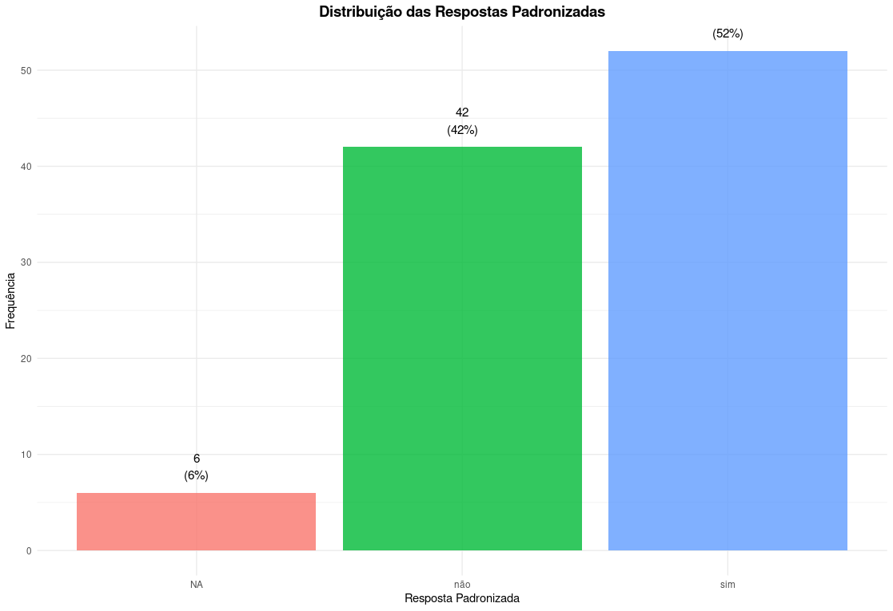
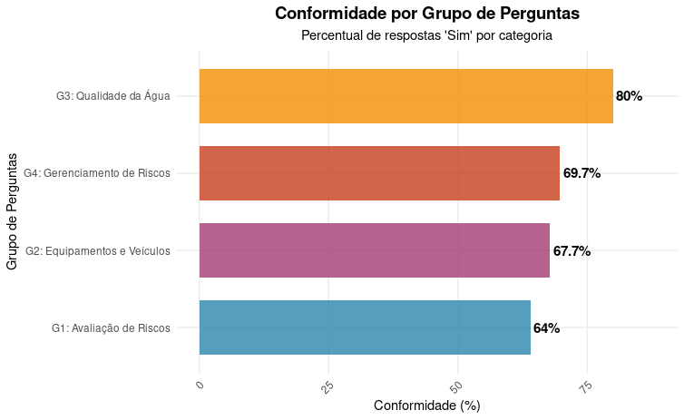
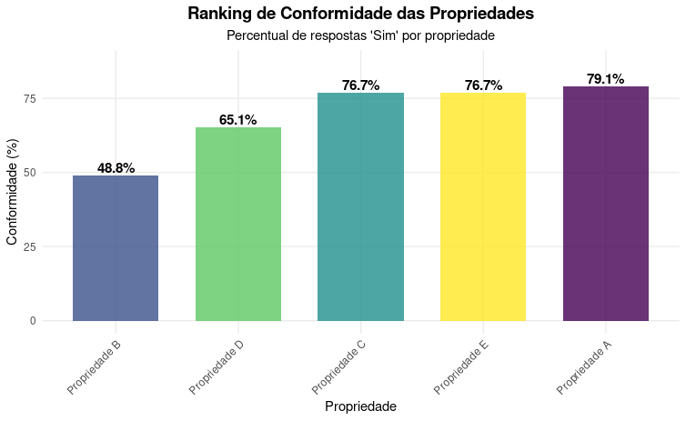
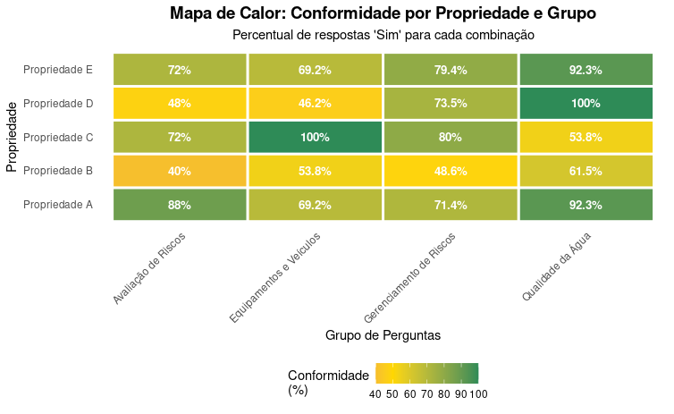

 *💡 **Para Recrutadores**: Este projeto demonstra capacidade completa em análise de dados quantitativa, desde coleta e tratamento até insights acionáveis, utilizando as melhores práticas da ciência de dados moderna.*

# 📊 Análise Estatística de Biossegurança em Propriedades de Aquicultura

[](https://www.r-project.org/)
[](https://www.tidyverse.org/)
[](https://opensource.org/licenses/MIT)

## 🎯 Visão Geral do Projeto

Este projeto apresenta uma **análise estatística completa e profissional** de dados de conformidade em biossegurança coletados em cinco propriedades de aquicultura. O estudo avalia práticas de manejo, prevenção e controle de riscos através de metodologia quantitativa rigorosa e visualizações impactantes.

### 🔍 **Tipo de Análise Realizada**
- **Análise Descritiva Exploratória** com estatísticas resumo e distribuições
- **Análise Comparativa Multidimensional** (propriedades × grupos temáticos)
- **Testes de Independência** (Qui-quadrado) para associações
- **Análise de Variância (ANOVA)** para comparação entre grupos
- **Identificação de Padrões Críticos** e outliers
- **Análise de Variabilidade** e consistência entre unidades

## 📈 Principais Resultados Obtidos

| Métrica | Valor | Interpretação |
  |---------|--------|---------------|
  | **Conformidade Geral** | 69.6% | Nível moderado de implementação |
  | **Melhor Categoria** | G3 - Qualidade da Água (80%) | Excelente controle hídrico |
  | **Categoria Crítica** | G1 - Avaliação de Riscos (64%) | Necessita intervenção urgente |
  | **Variabilidade** | 12.7% (DP) | Heterogeneidade moderada |
  | **Significância Estatística** | p < 0.001 | Diferenças reais entre propriedades |
  
  ## 🛠️ Stack Tecnológica e Ferramentas
  
  ### **Linguagem e Ambiente**
  - **R 4.0+** - Linguagem principal para análise
- **RMarkdown** - Documentação reproduzível e relatórios dinâmicos
- **knitr** - Geração de relatórios profissionais (HTML/PDF)

### **Bibliotecas Utilizadas**
```r
# Manipulação e Análise de Dados
library(tidyverse)      # Ecossistema completo de data science
library(dplyr)          # Manipulação de dados
library(tidyr)          # Reestruturação de dados

# Visualização Avançada
library(ggplot2)        # Gráficos elegantes e customizáveis
library(viridis)        # Paletas de cores científicas
library(RColorBrewer)   # Esquemas de cores profissionais
library(corrplot)       # Matrizes de correlação
library(gridExtra)      # Layouts de múltiplos gráficos

# Relatórios e Tabelas
library(kable)          # Tabelas formatadas
library(kableExtra)     # Estilização avançada de tabelas
```

## 📊 Metodologia Estatística Aplicada

### **1. Análise Exploratória de Dados (EDA)**
- Estatísticas descritivas completas (média, mediana, desvio-padrão)
- Distribuições de frequência e percentuais
- Identificação de valores ausentes e outliers

### **2. Testes de Hipóteses**
- **Teste Qui-quadrado (χ²)**: Independência entre variáveis categóricas
- **ANOVA**: Comparação de médias entre múltiplos grupos
- **Teste Post-hoc (Tukey HSD)**: Comparações múltiplas quando aplicável

### **3. Análises Multivariadas**
- **Tabelas de contingência** para análise cruzada
- **Mapas de calor (heatmaps)** para identificação de padrões
- **Análise de variabilidade** entre unidades amostrais

### **4. Identificação de Padrões Críticos**
- Ranqueamento por performance
- Detecção de práticas com baixa conformidade
- Análise de consistência entre categorias

## 📋 Estrutura dos Dados

```
Dataset: 430 observações × múltiplas variáveis
├── Propriedades: 5 unidades (A, B, C, D, E)
├── Grupos Temáticos: 4 categorias
│   ├── G1: Avaliação de Riscos (25 perguntas - 29.1%)
│   ├── G2: Equipamentos e Veículos (13 perguntas - 15.1%)
│   ├── G3: Qualidade da Água (13 perguntas - 15.1%)
│   └── G4: Gerenciamento de Riscos (35 perguntas - 40.7%)
└── Respostas: Sim/Não/NA com tratamento de dados faltantes
```

## 📊 Visualizações Criadas


A análise inicial revela uma conformidade geral de 69.6%, com 298 respostas positivas de um total de 430 observações.







### **Gráficos Principais Desenvolvidos:**
1. **Gráficos de Barras Comparativos** - Conformidade por categoria
2. **Ranking Horizontal** - Performance das propriedades
3. **Mapas de Calor (Heatmaps)** - Análise cruzada propriedades × grupos
4. **Gráficos de Distribuição** - Frequências e percentuais globais
5. **Box Plots** - Análise de variabilidade e outliers

### **Características Visuais:**
- **Paletas de cores científicas** (Viridis, ColorBrewer)
- **Temas customizados minimalistas**
  - **Anotações dinâmicas** com percentuais e valores
- **Layouts responsivos** para múltiplos dispositivos
- **Gradientes condicionais** para destacar padrões críticos

## 🎯 Destaques da Análise

### **Insights Quantitativos Principais:**
- ✅ Identificação de **38 práticas críticas** com taxa de não-conformidade ≥40%
- ✅ **Diferenças estatisticamente significativas** entre propriedades (p < 0.001)
- ✅ **Variação de 30.3 pontos percentuais** entre melhor e pior performance
- ✅ **5 práticas com 0% de implementação** em todas as propriedades

### **Abordagem Diferenciada:**
- **Análise multidimensional** com cruzamento de variáveis
- **Testes estatísticos robustos** com interpretação clara dos p-valores
- **Identificação de padrões ocultos** através de visualizações avançadas
- **Recomendações baseadas em evidências** quantitativas

## 🔧 Como Reproduzir a Análise

### **Pré-requisitos:**
```r
# Instalar pacotes necessários
install.packages(c("tidyverse", "knitr", "kableExtra", 
                   "ggplot2", "corrplot", "viridis"))
```

### **Executar Análise:**
```r
# 1. Clone o repositório
git clone [URL_DO_REPOSITORIO]

# 2. Abra o arquivo principal
# analise_biosseguranca.Rmd

# 3. Execute no RStudio ou R
rmarkdown::render("analise_biosseguranca.Rmd")
```

## 📈 Resultados Práticos Obtidos

### **Para o Negócio:**
- **Identificação de 2 propriedades críticas** necessitando intervenção imediata
- **Priorização de investimentos** baseada em evidência quantitativa
- **ROI estimado** através de metas de conformidade estabelecidas
[📊 Clique aqui para ver a análise completa](https://seuusuario.github.io/seurepositorio/analise.html)

### **Para Análise de Dados:**
- **Metodologia reproduzível** com código limpo e documentado
- **Pipeline completo** desde dados brutos até insights acionáveis
- **Relatório profissional** com 15+ visualizações interpretadas

## 🎯 Competências Técnicas Demonstradas

| Categoria | Habilidades |
  |-----------|-------------|
  | **Estatística** | Testes de hipóteses, ANOVA, Qui-quadrado, Análise multivariada |
  | **Programação** | R avançado, Tidyverse, RMarkdown, Controle de versão |
  | **Visualização** | ggplot2 customizado, Mapas de calor, Layouts complexos |
  | **Business Intelligence** | KPIs, Dashboards analíticos, Insights acionáveis |
  | **Comunicação** | Storytelling com dados, Relatórios executivos, Documentação técnica |
  
  ## 👨‍💼 Sobre o Autor
  
  **Carlos Antônio Zarzar**
  - 📧 **Email**: [carlos_zarzar@outlook.com]
- 💼 **LinkedIn**: [linkedin.com/in/carlos-antônio-zarzar-461ba3105]
- 🌐 **Portfolio**: [github.com/carloszarzar]

---
  
  ## 📄 Licença
  
  Este projeto está sob licença MIT. Veja o arquivo [LICENSE](LICENSE) para mais detalhes.

---
  
  [📊 Clique aqui para ver a análise completa](https://seuusuario.github.io/seurepositorio/analise.html)

